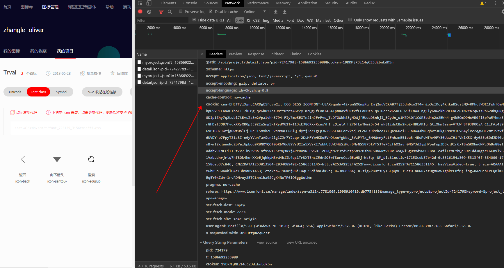

# iconfont-script-example

## Project setup
### 第一步
```
npm install iconfont-script -D
```
### 第二步

创建scripts文件夹，添加iconfont.js

```javascript
const path = require('path')
const {Iconfont} = require('iconfont-script');
const iconConfig = {
    url: 'https://www.iconfont.cn/api/project/download.zip?spm=a313x.7781069.1998910419.d7543c303&pid=1654297&ctoken=RjZZYphYli6XuLPqvp-ZAd7a',
    toPath: path.join(__dirname, '../src/assets/iconfont'),  // 写入目标路径
    cookie: 'iconfont网站登录后cookie'
}
new Iconfont(iconConfig).handleProcess()
```
控制台network iconfont 发送请求都会带着cookie

### Customize configuration
See [Configuration Reference](https://cli.vuejs.org/config/).
